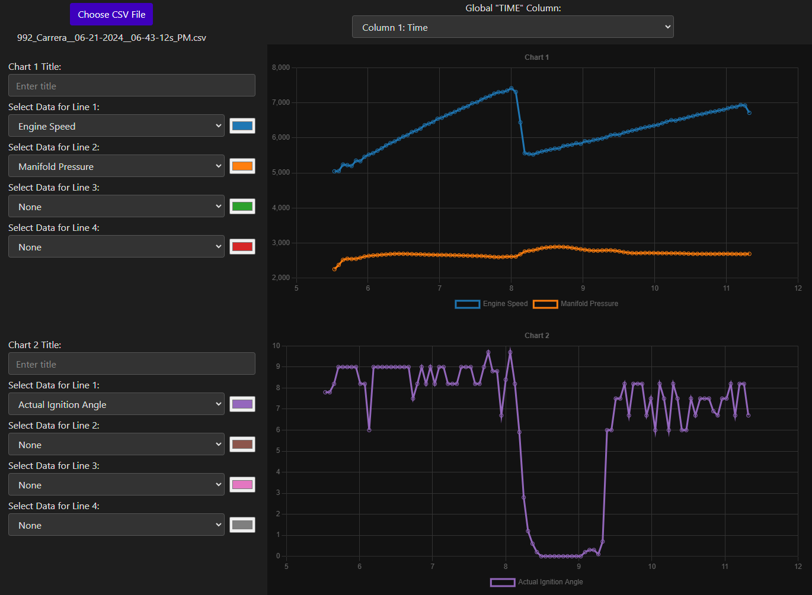
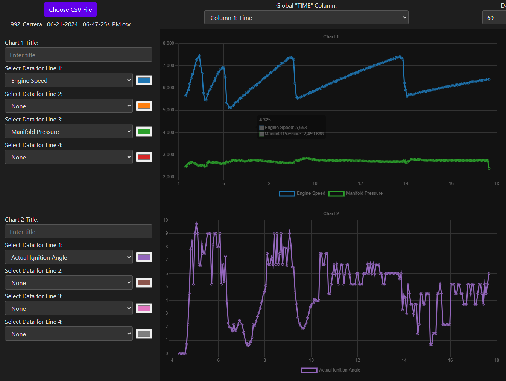
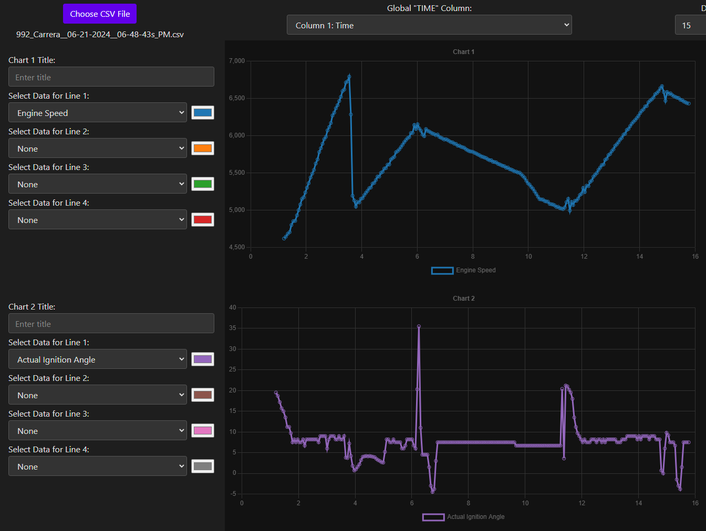
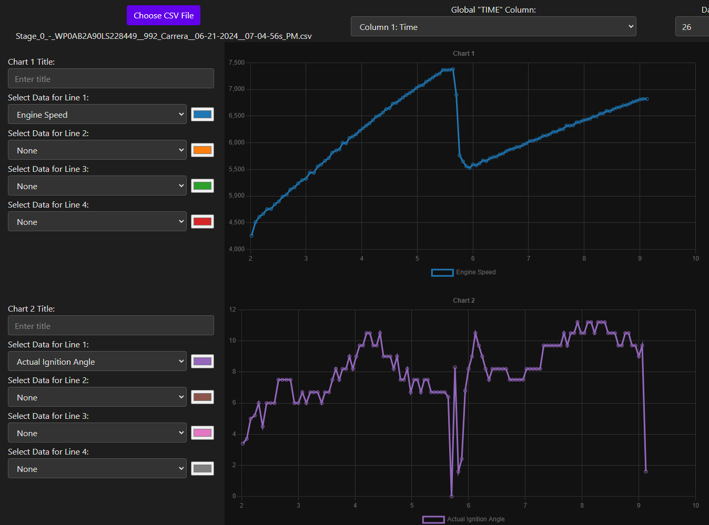
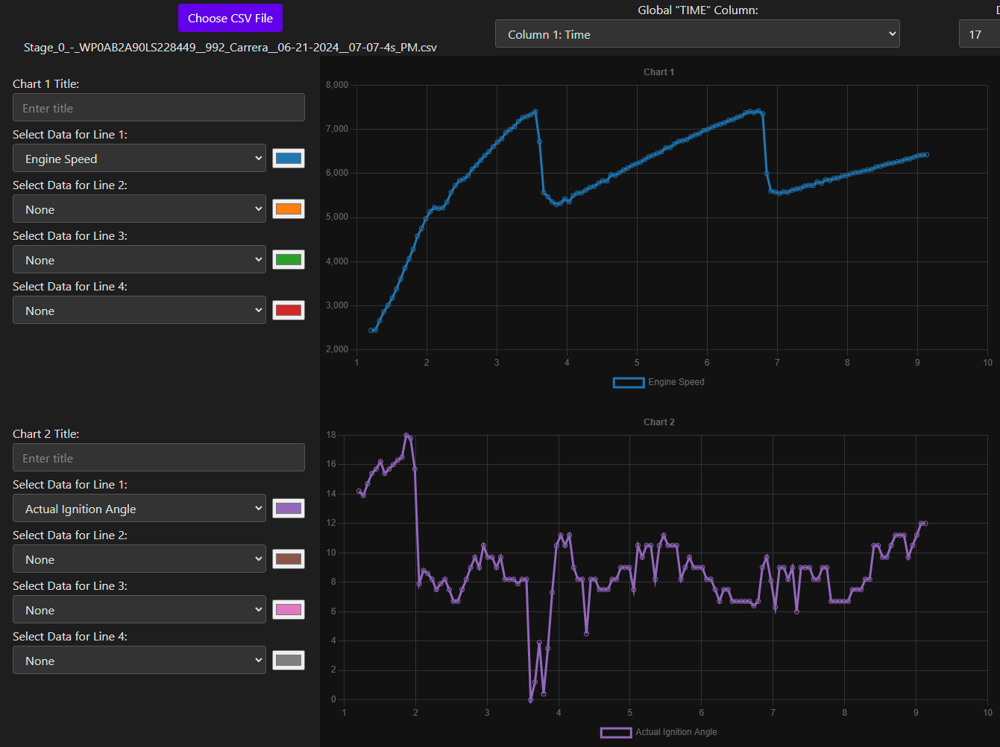
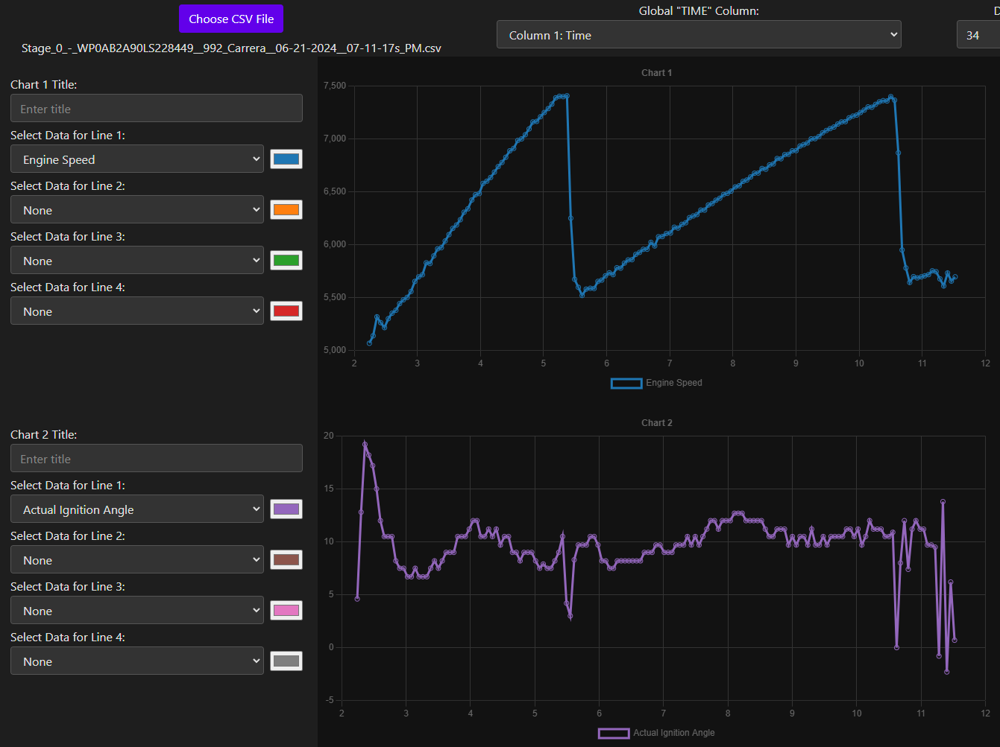

## Stage 2 - v103 tune logs:

Prime example of timing being pulled after a shift

[992_Carrera__06-21-2024__06-43-12s_PM.csv](./logs/v103/992_Carrera__06-21-2024__06-43-12s_PM.csv)

[992_Carrera__06-21-2024__06-43-12s_PM.ldat2](./logs/v103/992_Carrera__06-21-2024__06-43-12s_PM.ldat2)

Full 2-5 pull WOT, can see timing being pulled after the 3-4 and 4-5 shifts

[992_Carrera__06-21-2024__06-47-25s_PM.csv](./logs/v103/992_Carrera__06-21-2024__06-47-25s_PM.csv)

[992_Carrera__06-21-2024__06-47-25s_PM.ldat2](./logs/v103/992_Carrera__06-21-2024__06-47-25s_PM.ldat2)

SAME GEAR - Can see it pulls timing on the gear shift, but after accel, decel, and re-accel it doesn't seem to pull timing?

[992_Carrera__06-21-2024__06-48-43s_PM.csv](./logs/v103/992_Carrera__06-21-2024__06-48-43s_PM.csv)

[992_Carrera__06-21-2024__06-48-43s_PM.ldat2](./logs/v103/992_Carrera__06-21-2024__06-48-43s_PM.ldat2)

## Stage 0 (stock) tune logs:

Doesn't pull timing after gear shift?

[Stage_0_-_WP0AB2A90LS228449__992_Carrera__06-21-2024__07-04-56s_PM.csv](./logs/Stage0/Stage_0_-_WP0AB2A90LS228449__992_Carrera__06-21-2024__07-04-56s_PM.csv)

[Stage_0_-_WP0AB2A90LS228449__992_Carrera__06-21-2024__07-04-56s_PM.ldat2](./logs/Stage0/Stage_0_-_WP0AB2A90LS228449__992_Carrera__06-21-2024__07-04-56s_PM.ldat2)

2-4 pull WOT, doesn't seem to pull timing except RIGHT after 2-3 shift

[Stage_0_-_WP0AB2A90LS228449__992_Carrera__06-21-2024__07-07-4s_PM.csv](./logs/Stage0/Stage_0_-_WP0AB2A90LS228449__992_Carrera__06-21-2024__07-07-4s_PM.csv)

[Stage_0_-_WP0AB2A90LS228449__992_Carrera__06-21-2024__07-07-4s_PM.ldat2](./logs/Stage0/Stage_0_-_WP0AB2A90LS228449__992_Carrera__06-21-2024__07-07-4s_PM.ldat2)

Again didn't pull timing after gear shift

[Stage_0_-_WP0AB2A90LS228449__992_Carrera__06-21-2024__07-11-17s_PM.csv](./logs/Stage0/Stage_0_-_WP0AB2A90LS228449__992_Carrera__06-21-2024__07-11-17s_PM.csv)

[Stage_0_-_WP0AB2A90LS228449__992_Carrera__06-21-2024__07-11-17s_PM.ldat2](./logs/Stage0/Stage_0_-_WP0AB2A90LS228449__992_Carrera__06-21-2024__07-11-17s_PM.ldat2)
