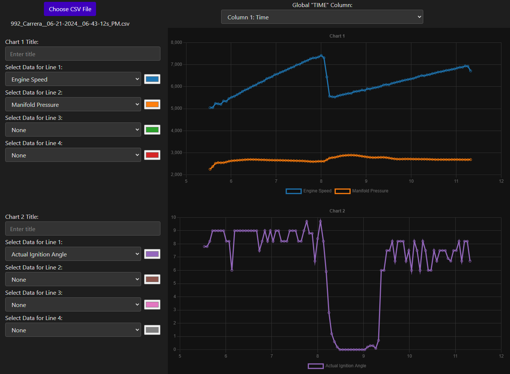
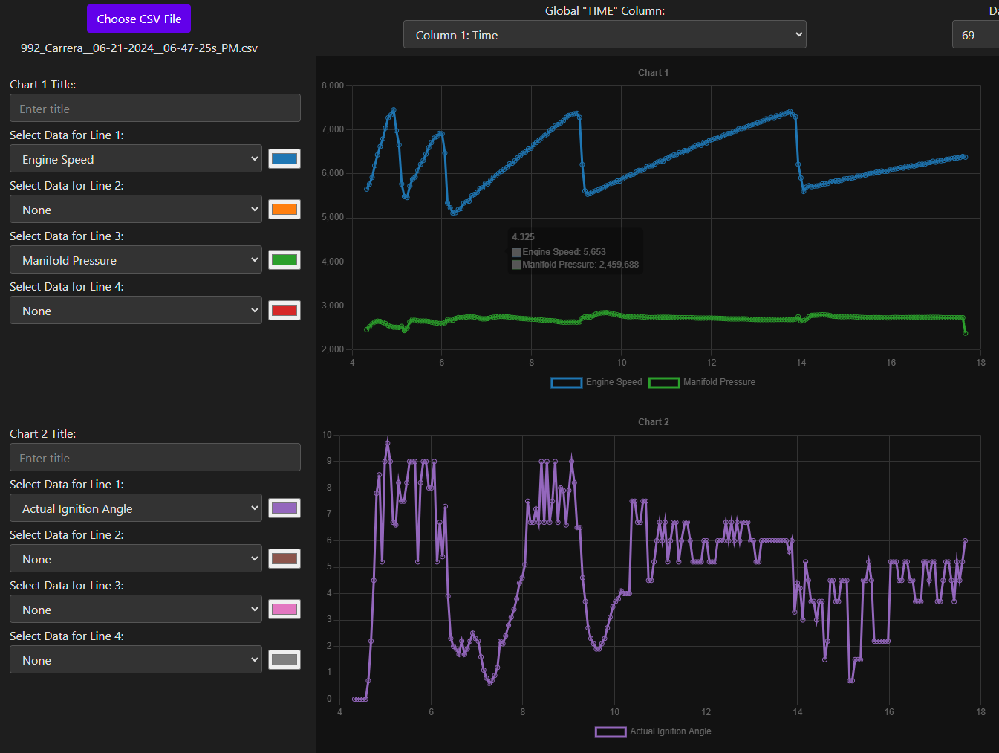
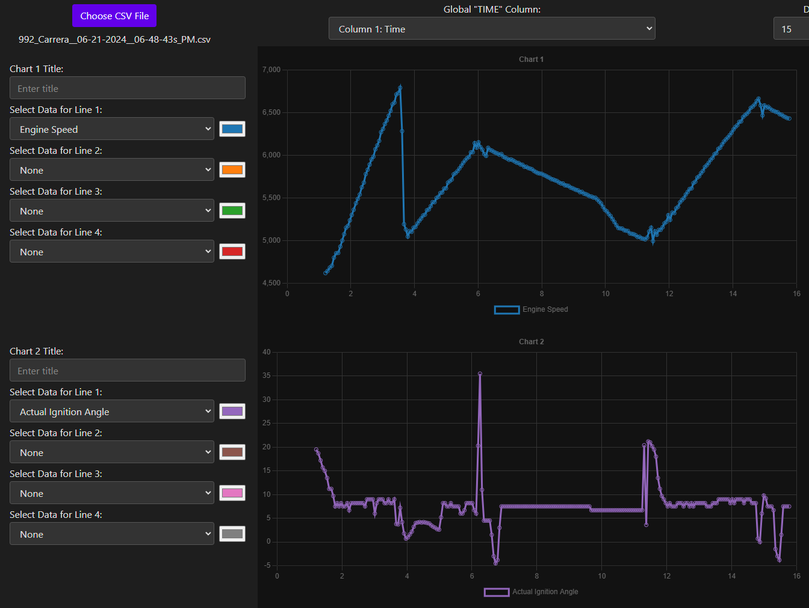
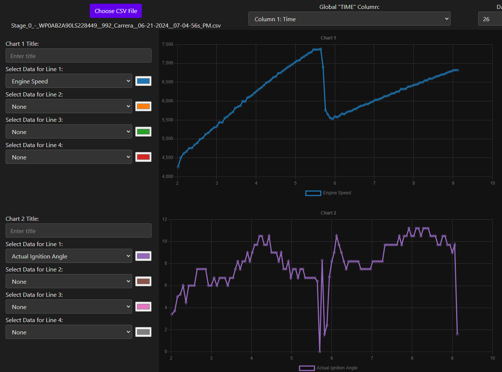
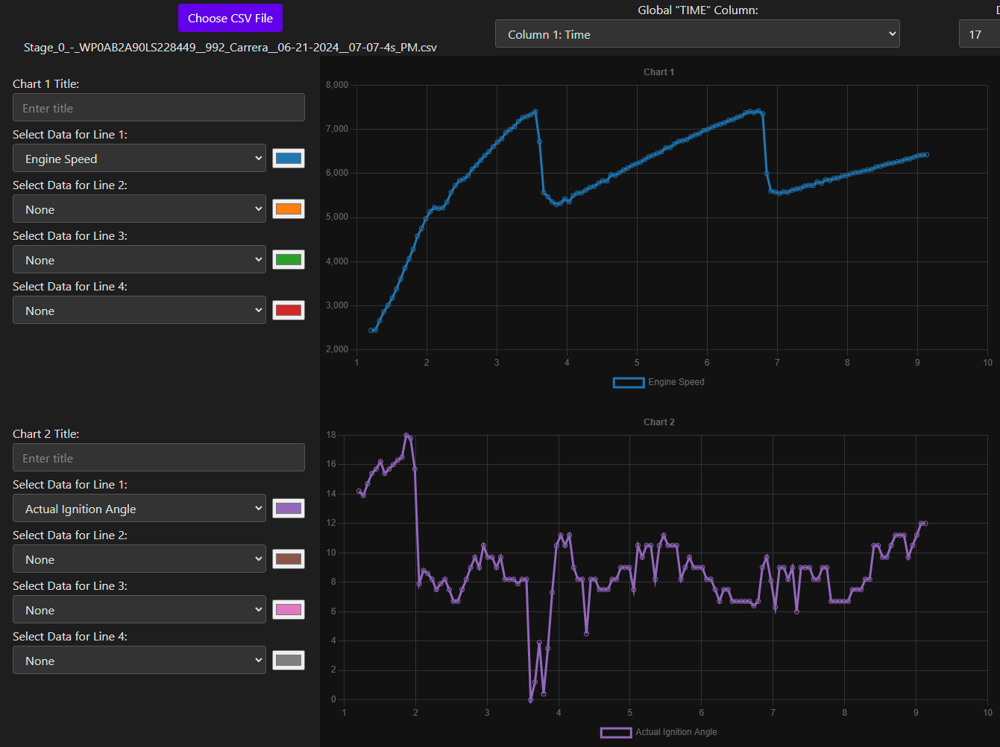
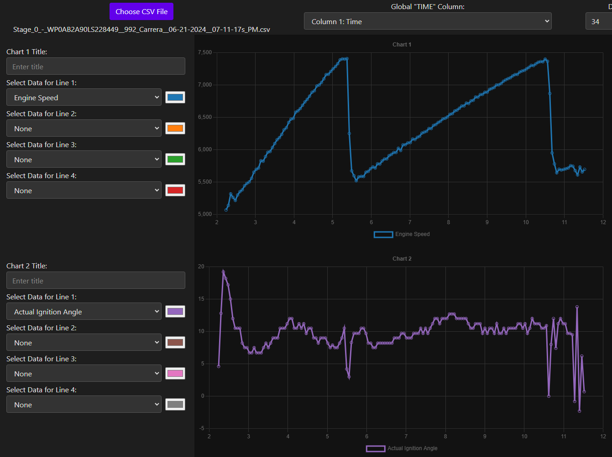

## Stage 2 - v103 tune logs:

Prime example of timing being pulled after a shift

VERY GOOD 2-5 pull WOT, can see timing being pulled after the 3-4 and 4-5 shifts

SAME GEAR - Can see it pulls timing on the gear shift, but after accel, decel, and re-accel it doesn't seem to pull timing?

## Stage 0 (stock) tune logs:

Doesn't pull timing after gear shift?

2-4 pull WOT, doesn't seem to pull timing except RIGHT after 2-3 shift

Again didn't pull timing after gear shift
